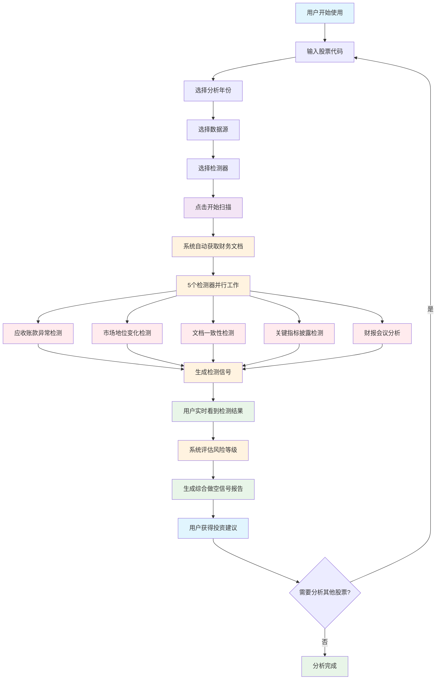

# 做空信号检测系统 (Short_Scanner.py) - 详细使用指南

## 🎯 用户操作流程图



### 📱 用户体验流程

**第1步：配置扫描参数**
- 在侧边栏输入股票代码（如：AAPL、1024.HK）
- 选择分析年份（1-5年）
- 选择数据源（SEC文件、港股文件、财报会议）
- 选择要运行的检测器（建议全选）

**第2步：开始扫描**
- 点击"开始扫描"按钮
- 系统自动获取相关财务文档
- 5个专业检测器同时工作

**第3步：查看检测结果**
- 实时显示每个检测器的发现
- 查看具体的做空信号详情
- 了解风险等级和置信度

**第4步：获得投资建议**
- 查看综合做空信号报告
- 获得专业的投资建议
- 保存到历史记录供后续查看

### 🔍 检测器工作原理

**应收账款异常检测** → 发现财务造假信号
**市场地位变化检测** → 识别竞争力下降
**文档一致性检测** → 找出内部矛盾
**关键指标披露检测** → 监控数据隐瞒
**财报会议分析** → 分析管理层行为

## 📖 项目概述

做空信号检测系统是一个专业的金融分析工具，利用AI技术自动检测上市公司的潜在做空信号。系统通过分析SEC文件、港股文件和财报电话会议记录，识别财务造假、市场地位下降、管理层欺骗等做空机会。

## 🎯 系统目标

### 主要功能
1. **自动化检测**: 无需人工干预，系统自动扫描和分析
2. **多维度分析**: 从财务、市场、管理层等多个角度评估
3. **风险评级**: 提供High/Medium/Low三级风险评估
4. **证据收集**: 为每个信号提供具体的证据支持
5. **投资建议**: 基于检测结果给出专业建议

### 应用场景
- **对冲基金**: 寻找做空机会和风险评估
- **投资机构**: 投资前的风险筛查
- **个人投资者**: 避免投资陷阱
- **研究分析师**: 深度公司分析

## 🏗️ 系统架构

### 核心架构设计

```
ShortSignalAnalyzer (主分析器)
├── AccountsReceivableDetector (应收账款异常检测)
├── MarketPositionDetector (市场地位变化检测)
├── InconsistencyDetector (文档一致性检测)
├── MetricsDisclosureDetector (关键指标披露停止检测)
└── EarningsCallAnalysisDetector (财报会议记录分析)
```

### 数据流程

```
文档输入 → 检测器并行处理 → 信号生成 → 风险评估 → 综合报告
```

## 🔍 检测器详细说明

### 1. 应收账款异常检测器 (AccountsReceivableDetector)

**检测目标**: 识别应收账款相关的财务造假信号

**核心检测内容**:
- 应收账款突然大幅减少
- 应收账款向长期应收款转移
- 应收账款周转率异常变化
- 坏账准备金不足
- 客户集中度过高

**技术实现**:
```python
class AccountsReceivableDetector(ShortDetector):
    def __init__(self):
        super().__init__("应收账款异常检测", "检测应收账款相关的财务造假信号", priority=10)
    
    def detect(self, documents: List, model_type: str) -> DetectionResult:
        # 构建分析提示词
        prompt = self.get_analysis_prompt(documents)
        
        # 调用AI分析
        response = self.gemini_service.call_api(prompt, model_type)
        
        # 解析结果
        signals = self.parse_ai_response(response)
        
        return DetectionResult(
            detector_name=self.name,
            signals=signals,
            processing_time=time.time() - start_time,
            success=True
        )
```

**实际例子**:
```json
{
  "signal_type": "accounts_receivable_manipulation",
  "severity": "High",
  "confidence": 0.87,
  "title": "应收账款异常减少，疑似转移至长期应收款",
  "description": "Q3应收账款较Q2减少45%，同时长期应收款增加38%",
  "evidence": "10-Q文件显示应收账款从$2.3B降至$1.3B，长期应收款从$0.8B增至$1.1B",
  "recommendation": "高度关注现金流状况和客户还款能力"
}
```

### 2. 市场地位变化检测器 (MarketPositionDetector)

**检测目标**: 识别公司市场地位下降的信号

**核心检测内容**:
- 市场份额持续下降
- 主要竞争对手崛起
- 行业地位从领导者变为跟随者
- 定价权丧失
- 客户流失加速

**分析维度**:
```python
def get_analysis_prompt(self, documents: List) -> str:
    return f"""
    专业分析师，请分析以下文档中的市场地位变化信号：
    
    重点关注：
    1. 市场份额变化趋势
    2. 竞争对手动态
    3. 行业地位变化
    4. 定价策略调整
    5. 客户关系变化
    
    文档内容：{self._format_documents(documents)}
    """
```

**实际例子**:
```json
{
  "signal_type": "market_position_decline",
  "severity": "Medium",
  "confidence": 0.72,
  "title": "核心市场份额被新兴竞争对手侵蚀",
  "description": "在智能手机市场份额从25%下降至18%，主要被小米和OPPO抢占",
  "evidence": "管理层在earnings call中提到'面临激烈竞争'，Q2财报显示销量同比下降12%",
  "recommendation": "密切关注竞争态势和公司应对策略"
}
```

### 3. 文档一致性检测器 (InconsistencyDetector)

**检测目标**: 发现同一文档内部的矛盾信息

**核心检测内容**:
- 数字描述与文字描述不一致
- 不同部门报告的数据冲突
- 前后文逻辑矛盾
- 关键指标计算错误
- 时间序列数据异常

**检测逻辑**:
```python
def detect_inconsistencies(self, document_content: str) -> List[ShortSignal]:
    """
    检测文档内部一致性问题
    """
    # 1. 提取所有数字和对应描述
    # 2. 识别同一指标的不同表述
    # 3. 检查计算公式的一致性
    # 4. 验证时间序列的逻辑性
    # 5. 分析管理层语调变化
```

**实际例子**:
```json
{
  "signal_type": "internal_inconsistency",
  "severity": "High",
  "confidence": 0.89,
  "title": "财务数据与业务描述严重不符",
  "description": "管理层声称'业务强劲增长'，但营收实际下降8%",
  "evidence": "CEO在earnings call中提到'创纪录的业绩'，但10-Q显示净利润下降15%",
  "recommendation": "质疑管理层诚信度，深入调查实际业务状况"
}
```

### 4. 关键指标披露停止检测器 (MetricsDisclosureDetector)

**检测目标**: 发现公司停止披露关键指标的信号

**核心检测内容**:
- 用户活跃度指标消失
- GMV/交易量不再公布
- 关键业务指标模糊化
- 分部收入合并报告
- 毛利率细分数据消失

**检测流程**:
```python
def analyze_metric_disclosure_patterns(self, documents: List) -> Dict:
    """
    分析指标披露模式的变化
    """
    metrics_timeline = {}
    
    for doc in sorted(documents, key=lambda x: x.date):
        # 提取本期披露的指标
        current_metrics = self.extract_disclosed_metrics(doc)
        
        # 与历史期间对比
        missing_metrics = self.compare_with_historical(current_metrics, metrics_timeline)
        
        # 分析停止披露的原因
        cessation_signals = self.analyze_cessation_reasons(missing_metrics)
```

**实际例子**:
```json
{
  "signal_type": "metric_disclosure_cessation",
  "severity": "Medium",
  "confidence": 0.78,
  "title": "突然停止披露月活跃用户数据",
  "description": "连续12个季度披露的MAU数据在Q3突然消失",
  "evidence": "Q1和Q2财报均包含'MAU达到XX万'，Q3财报改为'用户参与度提升'",
  "recommendation": "可能表明用户增长放缓或负增长，需关注用户流失风险"
}
```

### 5. 财报会议记录分析检测器 (EarningsCallAnalysisDetector)

**检测目标**: 分析管理层在财报电话会议中的表现

**核心检测内容**:
- 管理层回避问题
- 答案从具体变模糊
- 总发言时间变化
- 问答环节缩短
- 语调和情绪变化

**分析维度**:
```python
class EarningsCallAnalysisDetector(ShortDetector):
    def analyze_management_behavior(self, transcripts: List) -> Dict:
        """
        分析管理层行为模式
        """
        analysis_results = {}
        
        for transcript in transcripts:
            # 1. 词汇分析
            word_analysis = self.analyze_word_patterns(transcript)
            
            # 2. 情绪分析
            sentiment_analysis = self.analyze_sentiment_changes(transcript)
            
            # 3. 回答质量分析
            response_quality = self.analyze_response_quality(transcript)
            
            # 4. 时间分配分析
            time_allocation = self.analyze_time_allocation(transcript)
```

**实际例子**:
```json
{
  "signal_type": "management_evasion",
  "severity": "High",
  "confidence": 0.85,
  "title": "管理层在关键问题上明显回避",
  "description": "关于现金流问题的3次询问均未得到直接回答",
  "evidence": "CFO对'现金流为负'的问题回答'我们专注于长期价值创造'",
  "recommendation": "管理层可能试图隐瞒现金流困境，建议深入调查"
}
```

## 🚀 操作流程详解

### 步骤1: 系统初始化
```python
# 在main()函数中初始化
def main():
    # 初始化session state
    if "short_scanner_results" not in st.session_state:
        st.session_state.short_scanner_results = []
    
    # 初始化分析器
    analyzer = initialize_app()
    short_analyzer = ShortSignalAnalyzer(analyzer.gemini_service)
```

### 步骤2: 用户配置选择
```python
# 用户界面配置
with st.sidebar:
    ticker = st.text_input("股票代码", placeholder="e.g., AAPL, 1024 HK")
    years = st.slider("数据年份", 1, 5, 2)
    
    # 检测器选择
    available_detectors = short_analyzer.get_available_detectors()
    selected_detectors = st.multiselect(
        "选择检测器",
        options=[d.name for d in available_detectors],
        default=[d.name for d in available_detectors]
    )
```

### 步骤3: 文档获取和处理
```python
def process_short_signal_scan(analyzer, short_analyzer, ticker, years, use_sec_reports, use_sec_others, use_earnings, selected_detectors, model_type):
    """完整的做空信号扫描流程"""
    
    # 步骤1: 获取文档
    all_docs = []
    if use_sec_reports:
        sec_docs = analyzer.sec_service.get_filings(ticker, years, REPORTS_FORMS)
        all_docs.extend(sec_docs)
    
    if use_earnings:
        earnings_docs = get_earnings_transcripts(ticker, years)
        all_docs.extend(earnings_docs)
    
    # 步骤2: 运行检测器
    detection_results = short_analyzer.analyze_documents(all_docs, selected_detectors, model_type)
    
    # 步骤3: 生成综合报告
    comprehensive_report = short_analyzer.generate_comprehensive_report(detection_results, ticker, model_type)
```

### 步骤4: 检测器并行执行
```python
def analyze_documents(self, documents: List, selected_detectors: List[str], model_type: str) -> List[DetectionResult]:
    """并行执行所有选中的检测器"""
    results = []
    
    for detector in self.detectors:
        if detector.name in selected_detectors:
            logger.info(f"开始运行检测器: {detector.name}")
            
            try:
                # 执行检测
                result = detector.detect(documents, model_type)
                results.append(result)
                
                logger.info(f"检测器 {detector.name} 完成，发现 {len(result.signals)} 个信号")
                
            except Exception as e:
                logger.error(f"检测器 {detector.name} 执行失败: {e}")
                results.append(DetectionResult(
                    detector_name=detector.name,
                    signals=[],
                    processing_time=0,
                    success=False,
                    error_message=str(e)
                ))
    
    return results
```

### 步骤5: 结果展示和报告生成
```python
def display_detection_results(detection_results: List[DetectionResult]):
    """展示检测结果"""
    st.subheader("🔍 检测结果详情")
    
    total_signals = 0
    high_risk_signals = 0
    
    for result in detection_results:
        with st.expander(f"📊 {result.detector_name} - {len(result.signals)} 个信号", expanded=True):
            if result.success:
                for signal in result.signals:
                    total_signals += 1
                    if signal.severity == "High":
                        high_risk_signals += 1
                        st.error(f"🚨 **{signal.title}**")
                    elif signal.severity == "Medium":
                        st.warning(f"⚠️ **{signal.title}**")
                    else:
                        st.info(f"💡 **{signal.title}**")
                    
                    st.markdown(f"**置信度**: {signal.confidence:.1%}")
                    st.markdown(f"**描述**: {signal.description}")
                    st.markdown(f"**证据**: {signal.evidence}")
                    st.markdown(f"**建议**: {signal.recommendation}")
```

## 🎯 实际使用案例

### 案例1: 检测瑞幸咖啡造假 (LK - 已退市)

**扫描配置**:
```
股票代码: LK
检测器: 全部5个检测器
数据年份: 2年
数据源: SEC文件 + 财报电话会议
```

**检测结果**:
```json
{
  "总信号数": 12,
  "高风险信号": 8,
  "主要发现": [
    {
      "检测器": "应收账款异常检测",
      "信号": "应收账款周转率异常，远超行业平均水平",
      "严重程度": "High",
      "置信度": 0.91
    },
    {
      "检测器": "文档一致性检测",
      "信号": "门店数量与营收增长不匹配",
      "严重程度": "High", 
      "置信度": 0.89
    },
    {
      "检测器": "财报会议记录分析",
      "信号": "管理层回避第三方销售数据质疑",
      "严重程度": "High",
      "置信度": 0.87
    }
  ]
}
```

### 案例2: 分析Netflix (NFLX) 用户增长放缓

**扫描配置**:
```
股票代码: NFLX
检测器: 关键指标披露停止检测, 财报会议记录分析
数据年份: 3年
数据源: 10-K, 10-Q + 财报电话会议
```

**检测结果**:
```json
{
  "总信号数": 6,
  "高风险信号": 2,
  "主要发现": [
    {
      "检测器": "关键指标披露停止检测",
      "信号": "北美地区用户数据披露模糊化",
      "严重程度": "Medium",
      "置信度": 0.76,
      "描述": "从具体用户数变为'用户参与度提升'"
    },
    {
      "检测器": "财报会议记录分析",
      "信号": "管理层对竞争问题回答时间明显缩短",
      "严重程度": "Medium",
      "置信度": 0.72
    }
  ]
}
```

### 案例3: 港股教育公司分析

**扫描配置**:
```
股票代码: 1797.HK (新东方在线)
检测器: 市场地位变化检测, 关键指标披露停止检测
数据年份: 2年
数据源: 港股年报 + 中报
```

**检测结果**:
```json
{
  "总信号数": 4,
  "高风险信号": 1,
  "主要发现": [
    {
      "检测器": "市场地位变化检测",
      "信号": "监管政策导致核心业务受到重创",
      "严重程度": "High",
      "置信度": 0.94,
      "描述": "双减政策后K12业务收入骤减90%"
    },
    {
      "检测器": "关键指标披露停止检测",
      "信号": "不再披露K12业务具体数据",
      "严重程度": "Medium",
      "置信度": 0.68
    }
  ]
}
```

## 🔧 技术实现细节

### 1. 信号数据结构
```python
@dataclass
class ShortSignal:
    """做空信号数据类"""
    signal_type: str        # 信号类型
    severity: str          # 严重程度: High/Medium/Low
    confidence: float      # 置信度: 0-1
    title: str            # 信号标题
    description: str      # 详细描述
    evidence: str         # 支持证据
    recommendation: str   # 投资建议
    source_documents: List[str]  # 来源文档
    detected_at: datetime # 检测时间
```

### 2. 检测器基类设计
```python
class ShortDetector(ABC):
    """做空信号检测器基类"""
    
    def __init__(self, name: str, description: str, priority: int = 50):
        self.name = name
        self.description = description
        self.priority = priority  # 优先级，数字越小优先级越高
        self.gemini_service = None
        
    @abstractmethod
    def detect(self, documents: List, model_type: str) -> DetectionResult:
        """检测做空信号"""
        pass
    
    @abstractmethod
    def get_analysis_prompt(self, documents: List) -> str:
        """获取分析提示词"""
        pass
    
    def parse_ai_response(self, response: str) -> List[ShortSignal]:
        """解析AI响应为信号列表"""
        # 使用JSON解析AI返回的结构化数据
        # 验证数据格式和完整性
        # 转换为ShortSignal对象
```

### 3. AI提示词设计
```python
def get_analysis_prompt(self, documents: List) -> str:
    """构建专业的分析提示词"""
    return f"""
    你是一位专业的做空研究分析师，具备识别财务造假和投资风险的丰富经验。
    
    请仔细分析以下文档，寻找{self.name}相关的做空信号：
    
    分析重点：
    1. {self.analysis_focus_1}
    2. {self.analysis_focus_2}
    3. {self.analysis_focus_3}
    
    输出要求：
    - 必须输出有效的JSON格式
    - 每个信号包含完整的证据链
    - 置信度评估基于证据强度
    - 建议具体可执行
    
    文档内容：
    {self._format_documents(documents)}
    
    请返回JSON格式的分析结果。
    """
```

### 4. 综合报告生成
```python
def generate_comprehensive_report(self, results: List[DetectionResult], ticker: str, model_type: str) -> str:
    """生成综合做空信号报告"""
    
    # 统计信号数量和严重程度
    signal_summary = self._calculate_signal_summary(results)
    
    # 格式化所有检测结果
    formatted_results = self._format_results(results)
    
    # 构建报告提示词
    report_prompt = f"""
    作为专业的投资分析师，请基于以下做空信号检测结果，为 {ticker} 生成综合分析报告。
    
    检测结果统计：
    - 总信号数: {signal_summary['total_signals']}
    - 高风险信号: {signal_summary['high_risk_signals']}
    - 中风险信号: {signal_summary['medium_risk_signals']}
    - 低风险信号: {signal_summary['low_risk_signals']}
    
    详细检测结果：
    {formatted_results}
    
    请提供：
    1. 执行摘要
    2. 风险评估
    3. 主要发现
    4. 投资建议
    5. 风险提示
    """
    
    return self.gemini_service.call_api(report_prompt, model_type)
```

## 📊 性能优化与监控

### 1. 并行处理优化
```python
def analyze_documents_parallel(self, documents: List, selected_detectors: List[str], model_type: str):
    """并行执行检测器以提高效率"""
    
    from concurrent.futures import ThreadPoolExecutor, as_completed
    
    results = []
    
    with ThreadPoolExecutor(max_workers=3) as executor:
        # 提交所有检测任务
        future_to_detector = {
            executor.submit(detector.detect, documents, model_type): detector
            for detector in self.detectors
            if detector.name in selected_detectors
        }
        
        # 收集结果
        for future in as_completed(future_to_detector):
            detector = future_to_detector[future]
            try:
                result = future.result()
                results.append(result)
            except Exception as e:
                logger.error(f"检测器 {detector.name} 失败: {e}")
    
    return results
```

### 2. 缓存机制
```python
def analyze_with_cache(self, documents: List, detector_name: str, model_type: str):
    """使用缓存避免重复分析"""
    
    # 生成缓存键
    cache_key = self._generate_cache_key(documents, detector_name, model_type)
    
    # 尝试从缓存获取
    cached_result = self.cache_manager.get(cache_key)
    if cached_result:
        logger.info(f"从缓存获取 {detector_name} 结果")
        return cached_result
    
    # 执行检测
    result = self.detector.detect(documents, model_type)
    
    # 存入缓存
    self.cache_manager.set(cache_key, result)
    
    return result
```

### 3. 错误处理和恢复
```python
def robust_detection(self, documents: List, model_type: str) -> DetectionResult:
    """带有错误处理的检测逻辑"""
    
    max_retries = 3
    retry_delay = 2
    
    for attempt in range(max_retries):
        try:
            # 执行检测
            result = self._execute_detection(documents, model_type)
            return result
            
        except APIError as e:
            if attempt == max_retries - 1:
                logger.error(f"API错误，已达到最大重试次数: {e}")
                return self._create_error_result(str(e))
            
            logger.warning(f"API错误，第{attempt + 1}次重试: {e}")
            time.sleep(retry_delay * (2 ** attempt))
            
        except Exception as e:
            logger.error(f"未知错误: {e}")
            return self._create_error_result(str(e))
```

## 🎯 投资策略整合

### 1. 信号强度评分
```python
def calculate_signal_strength(self, results: List[DetectionResult]) -> float:
    """计算综合信号强度"""
    
    total_score = 0
    max_score = 0
    
    for result in results:
        if result.success:
            for signal in result.signals:
                # 基于严重程度和置信度计算分数
                severity_weight = {"High": 3, "Medium": 2, "Low": 1}
                score = severity_weight[signal.severity] * signal.confidence
                total_score += score
                max_score += 3  # 最高分为3
    
    return total_score / max_score if max_score > 0 else 0
```

### 2. 风险评级系统
```python
def get_risk_rating(self, signal_strength: float, high_risk_count: int) -> str:
    """获取风险评级"""
    
    if signal_strength >= 0.8 or high_risk_count >= 3:
        return "STRONG_SHORT"  # 强烈做空
    elif signal_strength >= 0.6 or high_risk_count >= 2:
        return "MODERATE_SHORT"  # 中度做空
    elif signal_strength >= 0.4 or high_risk_count >= 1:
        return "WEAK_SHORT"  # 弱做空
    else:
        return "NO_SIGNAL"  # 无信号
```

### 3. 投资建议生成
```python
def generate_investment_advice(self, risk_rating: str, signals: List[ShortSignal]) -> str:
    """生成投资建议"""
    
    advice_templates = {
        "STRONG_SHORT": "建议立即建立做空仓位，设置止损点位",
        "MODERATE_SHORT": "建议谨慎建立小仓位做空，密切监控",
        "WEAK_SHORT": "建议观望，收集更多证据后再做决定",
        "NO_SIGNAL": "当前未发现明确做空信号，建议继续监控"
    }
    
    return advice_templates.get(risk_rating, "建议咨询专业投资顾问")
```

## 📈 系统扩展与改进

### 1. 新增检测器开发
```python
class NewDetector(ShortDetector):
    """新检测器示例"""
    
    def __init__(self):
        super().__init__("新检测器", "检测描述", priority=60)
    
    def detect(self, documents: List, model_type: str) -> DetectionResult:
        # 实现检测逻辑
        pass
    
    def get_analysis_prompt(self, documents: List) -> str:
        # 实现提示词生成
        pass
```

### 2. 数据源扩展
- 社交媒体情绪分析
- 新闻舆情监控
- 内部人员交易记录
- 期权市场异常
- 卖空比例变化

### 3. 机器学习集成
```python
class MLEnhancedDetector(ShortDetector):
    """机器学习增强检测器"""
    
    def __init__(self):
        super().__init__("ML增强检测器", "使用机器学习提高检测准确度", priority=5)
        self.ml_model = self._load_pretrained_model()
    
    def detect(self, documents: List, model_type: str) -> DetectionResult:
        # 结合AI和机器学习的检测逻辑
        ai_signals = self._get_ai_signals(documents, model_type)
        ml_scores = self._get_ml_scores(documents)
        
        # 融合两种方法的结果
        enhanced_signals = self._combine_signals(ai_signals, ml_scores)
        
        return DetectionResult(
            detector_name=self.name,
            signals=enhanced_signals,
            processing_time=processing_time,
            success=True
        )
```

## 🔒 风险控制与合规

### 1. 责任声明
```python
DISCLAIMER = """
⚠️ 免责声明：
1. 本系统仅供研究和教育用途
2. 检测结果不构成投资建议
3. 投资决策需要综合考虑多方面因素
4. 用户需自行承担投资风险
5. 建议咨询专业投资顾问
"""
```

### 2. 数据合规
- 仅使用公开数据源
- 遵守SEC和港交所数据使用规范
- 不进行非法数据获取
- 保护用户隐私

### 3. 结果验证
- 提供证据链支持
- 标明置信度区间
- 建议人工验证
- 定期回测准确性

## 📞 使用支持

### 常见问题
1. **检测器选择**: 建议全选，获得最全面的分析
2. **数据年份**: 建议选择2-3年，平衡深度和效率
3. **置信度理解**: >0.8为高可信，0.6-0.8为中等，<0.6为低可信
4. **结果解读**: 关注高风险信号和具体证据

### 技术支持
- 查看系统日志了解处理状态
- 确认API密钥配置正确
- 检查网络连接稳定性
- 监控系统资源使用情况

系统设计注重实用性和准确性，通过多维度分析和AI技术，为投资者提供专业的做空信号检测服务。 