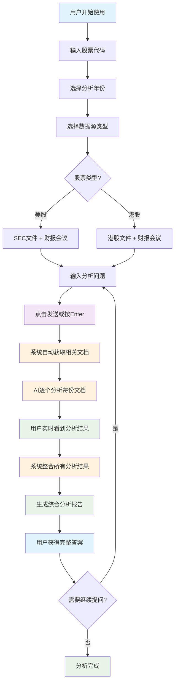

# SEC财报分析系统 (app.py) - 详细使用指南

## 🎯 用户操作流程图



### 📱 用户体验流程

**第1步：配置分析参数**
- 在侧边栏输入股票代码（如：AAPL、0700.HK）
- 选择分析年份（1-5年）
- 选择数据源（SEC文件、港股文件、财报会议）

**第2步：提出分析问题**
- 在聊天框输入具体问题
- 如："分析Apple的盈利能力"、"评估腾讯的业务风险"

**第3步：系统自动工作**
- 后台获取相关财务文档
- AI逐个分析每份文档
- 实时显示分析进度和结果

**第4步：获得完整答案**
- 查看每个文档的详细分析
- 获得综合分析报告
- 支持下载原始文档

## 📖 项目概述

SEC财报分析系统是一个基于Streamlit的智能财务分析工具，利用Google Gemini AI技术为投资者提供深度的财务文档分析服务。系统支持美国SEC文件、港股文件以及财报电话会议记录的智能分析。

## 🎯 核心功能

### 1. 多数据源整合
- **SEC文件分析**: 支持10-K、10-Q、8-K、20-F、6-K等多种SEC文件类型
- **港股文件分析**: 自动识别港股代码，获取香港交易所文件
- **财报电话会议**: 获取并分析earnings call transcripts

### 2. 智能AI分析
- **Google Gemini集成**: 支持Gemini 2.5 Flash和Pro模型
- **流式响应**: 实时显示分析结果
- **多语言支持**: 中英文界面切换

### 3. 高级功能
- **6-K文件处理**: 自动下载和处理6-K附件
- **缓存系统**: 减少重复请求，提高响应速度
- **错误处理**: 完善的错误处理和重试机制

## 🏗️ 系统架构

### 核心类结构

```
SECEarningsAnalyzer (主分析器)
├── SECService (SEC文件服务)
│   ├── SixKProcessor (6-K文件处理器)
│   └── DocumentManager (文档管理器)
├── HKStockService (港股服务)
│   └── HKStockFilingsDownloader (港股文件下载器)
├── EarningsService (财报服务)
├── GeminiService (AI服务)
├── CacheManager (缓存管理)
└── SessionManager (会话管理)
```

### 数据流程

```
用户输入 → 数据获取 → 内容处理 → AI分析 → 结果整合 → 展示输出
```

## 🚀 操作流程详解

### 步骤1: 系统初始化
```python
# 系统启动时自动执行
@st.cache_resource
def initialize_app():
    analyzer = SECEarningsAnalyzer()
    analyzer.session_manager.init_session_state()
    return analyzer
```

**背后工作**:
- 初始化所有服务组件
- 设置缓存管理器
- 配置API密钥和限制
- 创建临时文件目录

### 步骤2: 用户配置选择
```python
# 用户界面配置
ticker = st.text_input("股票代码", value="AAPL")
years = st.slider("分析年份", 1, 5, 3)
use_sec_reports = st.checkbox("包含SEC报告")
use_earnings = st.checkbox("包含财报电话会议")
```

**背后工作**:
- 验证股票代码格式
- 自动识别是否为港股
- 设置数据获取范围
- 配置分析参数

### 步骤3: 数据获取阶段
```python
def process_user_question_new(analyzer, ticker, years, use_sec_reports, use_sec_others, use_earnings, model_type):
    # 步骤1: 获取文档
    if status.processing_step == 1:
        all_docs = []
        
        # SEC文件获取
        if selected_forms and not is_hk_stock(ticker):
            documents = analyzer.sec_service.get_filings(ticker, years, selected_forms, sec_status_callback)
        
        # 港股文件获取
        elif is_hk_stock(ticker):
            documents = analyzer.hk_service.get_hk_filings(ticker, years, None, hk_status_callback)
        
        # 财报电话会议获取
        if use_earnings:
            quarters = analyzer.earnings_service.get_available_quarters(ticker)
            earnings_docs = analyzer.earnings_service.get_earnings_transcript_batch(quarters[:years*4])
```

**背后工作**:
- **SEC文件**: 通过EDGAR API获取文件列表，下载并解析内容
- **港股文件**: 从香港交易所API获取文件，处理中文内容
- **财报会议**: 从第三方数据源获取transcript，解析HTML内容
- **6-K处理**: 自动下载附件，转换PDF和HTML为文本
- **内容过滤**: 移除无关内容，保留关键财务信息

### 步骤4: 内容处理阶段
```python
# 步骤2: 文档处理
elif status.processing_step == 2:
    for i, document in enumerate(status.documents):
        if status.stop_requested:
            break
            
        # 流式处理文档
        result_generator = analyzer.process_document_stream(document, processing_prompt, model_type)
        
        # 实时显示结果
        result_placeholder = st.empty()
        full_result = ""
        
        for chunk in result_generator:
            if isinstance(chunk, dict) and "error" in chunk:
                st.error(chunk["error"])
                break
            full_result += chunk
            result_placeholder.markdown(full_result)
```

**背后工作**:
- **内容预处理**: 清理HTML标签，格式化文本
- **长度限制**: 自动截断过长内容，保留关键部分
- **AI分析**: 使用Gemini模型分析单个文档
- **流式输出**: 实时显示分析进度
- **错误处理**: 捕获和处理API错误

### 步骤5: 结果整合阶段
```python
# 步骤3: 结果整合
elif status.processing_step == 3:
    integration_generator = analyzer.integrate_results_stream(
        status.document_results, 
        integration_prompt, 
        user_question, 
        ticker, 
        model_type
    )
    
    final_result = ""
    for chunk in integration_generator:
        if isinstance(chunk, dict) and "error" in chunk:
            st.error(chunk["error"])
            break
        final_result += chunk
        final_placeholder.markdown(final_result)
```

**背后工作**:
- **结果聚合**: 整合所有文档的分析结果
- **交叉验证**: 对比不同文档的信息一致性
- **综合判断**: 基于多个数据源形成最终结论
- **格式化输出**: 生成结构化的分析报告

## 🎯 实际使用例子

### 例子1: 分析苹果公司(AAPL)的财务状况

**输入配置**:
```
股票代码: AAPL
分析年份: 3年
数据源: SEC报告 + 财报电话会议
模型: Gemini 2.5 Flash
问题: "分析苹果公司的营收增长趋势和盈利能力"
```

**系统执行流程**:

1. **数据获取** (30-60秒)
   - 获取AAPL最近3年的10-K, 10-Q文件
   - 下载最近12个季度的earnings call transcripts
   - 处理6-K文件及其附件

2. **内容处理** (2-5分钟)
   - 分析每个10-K文件的财务数据
   - 处理每个earnings call的管理层讨论
   - 提取关键财务指标和趋势

3. **结果整合** (30-60秒)
   - 综合所有文档的分析结果
   - 生成营收增长趋势图表
   - 提供盈利能力分析结论

**输出结果**:
```markdown
# 苹果公司(AAPL)财务分析报告

## 营收增长趋势
- 2022-2024年营收复合增长率: 8.5%
- 主要增长驱动: iPhone销售、服务业务增长
- 地区分布: 美国占比45%, 中国占比19%

## 盈利能力分析
- 毛利率维持在38-40%区间
- 净利率稳定在25%左右
- ROE持续保持在28-30%高水平

## 关键风险因素
- 对中国市场的依赖性
- 硬件创新放缓
- 监管环境变化
```

### 例子2: 分析港股腾讯(0700.HK)

**输入配置**:
```
股票代码: 0700.HK
分析年份: 2年
数据源: 港股文件 + 财报电话会议
模型: Gemini 2.5 Pro
问题: "评估腾讯的游戏业务和云服务发展潜力"
```

**系统执行流程**:

1. **港股识别**: 自动识别为港股，调用HKStockService
2. **文件获取**: 从香港交易所获取年报、中报等文件
3. **中文处理**: 处理中英文混合的文档内容
4. **业务分析**: 专注于游戏和云服务业务板块

**输出结果**:
```markdown
# 腾讯控股(0700.HK)业务分析报告

## 游戏业务分析
- 国内游戏收入增长放缓,但海外市场表现强劲
- 《王者荣耀》持续贡献稳定收入
- 新游戏储备丰富,版号获取正常化

## 云服务发展潜力
- 云收入年增长率超过30%
- 在视频、游戏垂直领域优势明显
- 与阿里云、华为云的竞争加剧
```

## 🔧 技术实现细节

### 1. 缓存机制
```python
class CacheManager:
    def get_cache_key(self, *args) -> str:
        return hashlib.md5(str(args).encode()).hexdigest()
    
    def get(self, key: str, default=None):
        cache_data = st.session_state.cache.get(key)
        if cache_data and time.time() - cache_data["timestamp"] < self.ttl:
            return cache_data["value"]
        return default
```

### 2. 错误处理和重试
```python
def retry_on_failure(max_retries: int = 3, delay: float = 1.0):
    def decorator(func):
        def wrapper(*args, **kwargs):
            for attempt in range(max_retries):
                try:
                    return func(*args, **kwargs)
                except Exception as e:
                    if attempt == max_retries - 1:
                        raise
                    time.sleep(delay * (2 ** attempt))
```

### 3. 流式处理
```python
def process_document_stream(self, document: Document, processing_prompt: str, model_type: str):
    try:
        response_stream = self.gemini_service.call_api_stream(combined_prompt, model_type)
        for chunk in response_stream:
            if chunk.text:
                yield chunk.text
    except Exception as e:
        yield {"error": f"处理文档时出错: {str(e)}"}
```

## 📊 性能优化

### 1. 内容长度限制
- 单个文档最大800,000字符
- 自动截断并保留关键部分
- 智能摘要长文档

### 2. 并发处理
- 财报电话会议支持批量处理
- 6-K附件并行下载
- 异步文件处理

### 3. 内存管理
- 及时清理临时文件
- 使用生成器减少内存占用
- 缓存频繁访问的数据

## 🛠️ 配置说明

### 环境变量配置
```python
# secrets.toml
GEMINI_API_KEY = "your_api_key_here"
PREMIUM_API_KEY = "your_premium_key_here"
```

### 系统参数
```python
@dataclass
class Config:
    REQUEST_TIMEOUT: int = 30
    MAX_RETRIES: int = 3
    MAX_CONTENT_LENGTH: int = 800000
    CACHE_TTL: int = 3600
```

## 🚨 常见问题解决

### 1. API限制问题
- 使用免费API时注意请求频率
- 升级到付费API获得更好性能
- 实施请求排队机制

### 2. 文档获取失败
- 检查网络连接
- 验证股票代码格式
- 确认SEC/港交所服务状态

### 3. 内容处理错误
- 文档过长会自动截断
- 检查API密钥配置
- 监控系统日志

## 📈 未来发展计划

1. **更多数据源**: 加入更多国际市场数据
2. **增强AI能力**: 集成更多AI模型
3. **可视化改进**: 添加图表和仪表板
4. **自动化报告**: 定期生成和发送报告
5. **移动端适配**: 优化移动设备体验

## 📞 技术支持

如果您在使用过程中遇到任何问题，请查看：
- 系统日志输出
- 错误消息详情
- 网络连接状态
- API密钥配置

系统设计为高可用性和容错性，大多数问题都会自动恢复或给出明确的错误提示。 